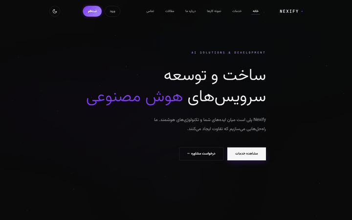
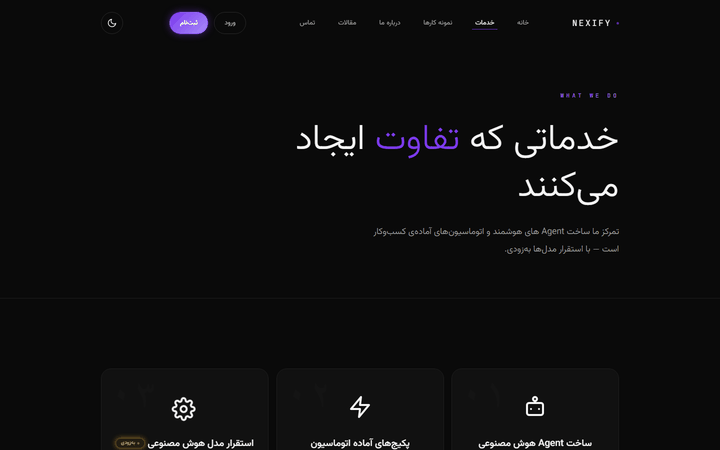
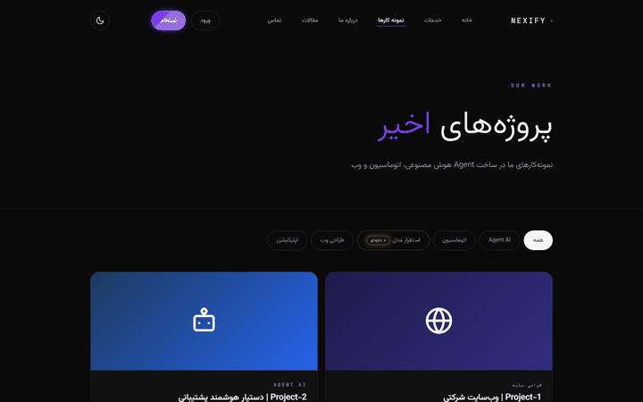
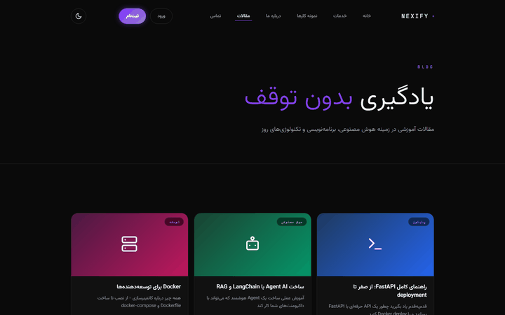
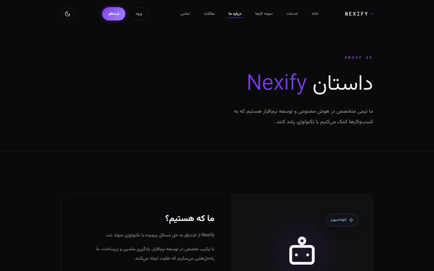
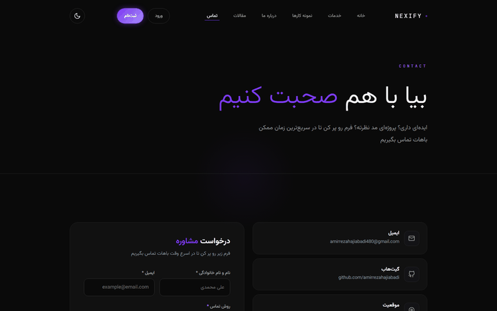
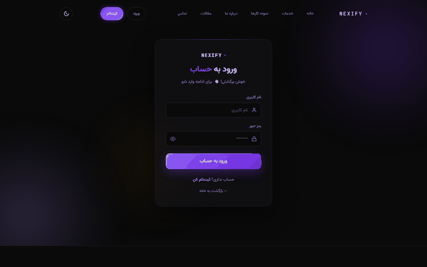
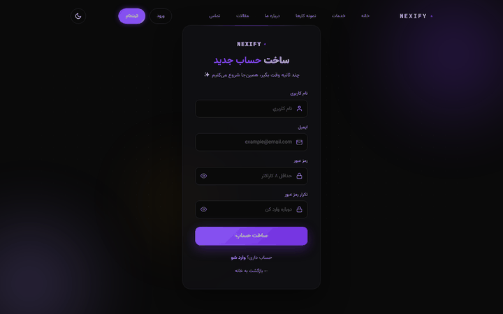

<div align="center" style="border:1px solid #3a3a45; border-radius:16px; overflow:hidden; max-width:880px;">
  <div style="background:#16161d; padding:10px 16px; direction:ltr; text-align:left;">
    <span style="display:inline-block; width:12px; height:12px; border-radius:50%; background:#ff5f57;"></span>
    <span style="display:inline-block; width:12px; height:12px; border-radius:50%; background:#febc2e; margin-left:6px;"></span>
    <span style="display:inline-block; width:12px; height:12px; border-radius:50%; background:#28c840; margin-left:6px;"></span>
    <span style="font-family:ui-monospace,SFMono-Regular,monospace; font-size:12px; color:#8b8b98; margin-left:12px;">nexify.ir</span>
  </div>
  <a href="docs/screenshots/home.png"></a>
</div>

<h1 align="center"> Nexify وب‌سایت</h1>

<p align="center">
  وب‌سایت کامل <strong>فارسی و راست‌چین (RTL)</strong> با تم تیره/روشن، طراحی شیشه‌ای و بک‌اند Django — یک <strong>نمونه‌کار</strong> در طراحی UI/UX، فرانت‌اند و بک‌اند.
</p>

<p align="center">
  
  
  
  
  
</p>

---

## 📸 پیش‌نمایش — دموی متحرک

دموهای زیر اسکرول واقعی صفحات را نشان می‌دهند؛ برای دیدن تصویر کامل باکیفیت، روی هر فریم کلیک کنید.

| | | |
|---|---|---|
| **خدمات**<br><div align="center" style="border:1px solid #3a3a45; border-radius:12px; overflow:hidden;"><div style="background:#16161d; padding:6px 10px; direction:ltr; text-align:left;"><span style="display:inline-block; width:10px; height:10px; border-radius:50%; background:#ff5f57;"></span><span style="display:inline-block; width:10px; height:10px; border-radius:50%; background:#febc2e; margin-left:5px;"></span><span style="display:inline-block; width:10px; height:10px; border-radius:50%; background:#28c840; margin-left:5px;"></span><span style="font-family:ui-monospace,monospace; font-size:11px; color:#8b8b98; margin-left:10px;">nexify.ir/services/</span></div><a href="docs/screenshots/services.png"></a></div> | **نمونه‌کارها**<br><div align="center" style="border:1px solid #3a3a45; border-radius:12px; overflow:hidden;"><div style="background:#16161d; padding:6px 10px; direction:ltr; text-align:left;"><span style="display:inline-block; width:10px; height:10px; border-radius:50%; background:#ff5f57;"></span><span style="display:inline-block; width:10px; height:10px; border-radius:50%; background:#febc2e; margin-left:5px;"></span><span style="display:inline-block; width:10px; height:10px; border-radius:50%; background:#28c840; margin-left:5px;"></span><span style="font-family:ui-monospace,monospace; font-size:11px; color:#8b8b98; margin-left:10px;">nexify.ir/projects/</span></div><a href="docs/screenshots/projects.png"></a></div> | **بلاگ**<br><div align="center" style="border:1px solid #3a3a45; border-radius:12px; overflow:hidden;"><div style="background:#16161d; padding:6px 10px; direction:ltr; text-align:left;"><span style="display:inline-block; width:10px; height:10px; border-radius:50%; background:#ff5f57;"></span><span style="display:inline-block; width:10px; height:10px; border-radius:50%; background:#febc2e; margin-left:5px;"></span><span style="display:inline-block; width:10px; height:10px; border-radius:50%; background:#28c840; margin-left:5px;"></span><span style="font-family:ui-monospace,monospace; font-size:11px; color:#8b8b98; margin-left:10px;">nexify.ir/blog/</span></div><a href="docs/screenshots/blog.png"></a></div> |
| **درباره ما**<br><div align="center" style="border:1px solid #3a3a45; border-radius:12px; overflow:hidden;"><div style="background:#16161d; padding:6px 10px; direction:ltr; text-align:left;"><span style="display:inline-block; width:10px; height:10px; border-radius:50%; background:#ff5f57;"></span><span style="display:inline-block; width:10px; height:10px; border-radius:50%; background:#febc2e; margin-left:5px;"></span><span style="display:inline-block; width:10px; height:10px; border-radius:50%; background:#28c840; margin-left:5px;"></span><span style="font-family:ui-monospace,monospace; font-size:11px; color:#8b8b98; margin-left:10px;">nexify.ir/about/</span></div><a href="docs/screenshots/about.png"></a></div> | **تماس با ما**<br><div align="center" style="border:1px solid #3a3a45; border-radius:12px; overflow:hidden;"><div style="background:#16161d; padding:6px 10px; direction:ltr; text-align:left;"><span style="display:inline-block; width:10px; height:10px; border-radius:50%; background:#ff5f57;"></span><span style="display:inline-block; width:10px; height:10px; border-radius:50%; background:#febc2e; margin-left:5px;"></span><span style="display:inline-block; width:10px; height:10px; border-radius:50%; background:#28c840; margin-left:5px;"></span><span style="font-family:ui-monospace,monospace; font-size:11px; color:#8b8b98; margin-left:10px;">nexify.ir/contact/</span></div><a href="docs/screenshots/contact.png"></a></div> | **ورود**<br><div align="center" style="border:1px solid #3a3a45; border-radius:12px; overflow:hidden;"><div style="background:#16161d; padding:6px 10px; direction:ltr; text-align:left;"><span style="display:inline-block; width:10px; height:10px; border-radius:50%; background:#ff5f57;"></span><span style="display:inline-block; width:10px; height:10px; border-radius:50%; background:#febc2e; margin-left:5px;"></span><span style="display:inline-block; width:10px; height:10px; border-radius:50%; background:#28c840; margin-left:5px;"></span><span style="font-family:ui-monospace,monospace; font-size:11px; color:#8b8b98; margin-left:10px;">nexify.ir/login/</span></div><a href="docs/screenshots/login.png"></a></div> |

<div align="center">**ثبت‌نام**<br><div align="center" style="border:1px solid #3a3a45; border-radius:12px; overflow:hidden; max-width:32%;"><div style="background:#16161d; padding:6px 10px; direction:ltr; text-align:left;"><span style="display:inline-block; width:10px; height:10px; border-radius:50%; background:#ff5f57;"></span><span style="display:inline-block; width:10px; height:10px; border-radius:50%; background:#febc2e; margin-left:5px;"></span><span style="display:inline-block; width:10px; height:10px; border-radius:50%; background:#28c840; margin-left:5px;"></span><span style="font-family:ui-monospace,monospace; font-size:11px; color:#8b8b98; margin-left:10px;">nexify.ir/register/</span></div><a href="docs/screenshots/register.png"></a></div></div>

---

## ✨ امکانات

- 🎨 **طراحی UI/UX** — تم تیره/روشن با سیستم توکن رنگی، شیشه‌ای (Glassmorphism)، انیمیشن‌های نرم و پلکانی، آیکون‌های SVG سفارشی، کنتراست AA
- 📱 **ریسپانسیو کامل** — از دسکتاپ تا موبایل، با تارگت‌های لمسی استاندارد
- 🛠 **پنل مدیریت سفارشی** (`/panel/`) — انتشار مقاله و پروژه، آپلود تصویر شاخص، مدیریت سفارش‌ها، ویرایش متن‌های سایت، چند ادمین، آمار بازدید
- 👤 **حساب کاربری** — ورود/ثبت‌نام با انیمیشن، پروفایل شخصی (درخواست‌ها + دیدگاه‌ها)، کامنت زیر مقالات
- 📬 **فرم تماس امن** — CSRF + هانی‌پات دولایه، انتخاب روش تماس (تلفن / تلگرام)
- 🗄 **محتوای داینامیک** — پروژه‌ها و مقالات از دیتابیس، با فیلتر انتشار
- 🔒 **امنیت** — CSP، هدرهای امنیتی، ضد-XSS، بلاک ریدایرکت خارجی، **۱۱۵ تست pytest** + CI

---

## 🛠 تکنولوژی‌ها

| لایه | تکنولوژی |
|---|---|
| فرانت‌اند | HTML · CSS مدرن (Custom Properties، Flex/Grid، Glassmorphism) · JavaScript خالص |
| بک‌اند | Python · Django · SQLite (توسعه) / PostgreSQL (تولید) |
| تست | pytest + pytest-django · GitHub Actions (Python 3.12 / 3.13) |
| فونت | Vazirmatn (self-host) + JetBrains Mono |

---

## 🚀 اجرای محلی

```bash
cd Nexify

python -m pip install -r requirements.txt
python manage.py migrate
python manage.py seed_demo            # دادهٔ نمونه (پروژه/مقاله/سوال متداول)
python manage.py createsuperuser      # ورود به /admin/ و /panel/
python manage.py runserver 127.0.0.1:8471
```

| مسیر | صفحه |
|---|---|
| `/` · `/services/` · `/projects/` · `/blog/` · `/about/` | صفحات عمومی |
| `/contact/` | تماس (فرم امن) |
| `/accounts/` | ورود / ثبت‌نام / پروفایل |
| `/panel/` | پنل ادمین سفارشی (فقط staff) |

---

## 🔒 امنیت

- CSRF روی همهٔ فرم‌ها + **هانی‌پات دولایه** (کلاینت و سرور)
- **CSP** + هدرهای امنیتی برای دیپلوی
- ساخت DOM امن بدون `innerHTML` با دادهٔ داینامیک (ضد XSS)
- ۱۱۵ تست pytest + CI خودکار روی هر push

---

## 📬 تماس

این پروژه یک **نمونه‌کار** است — برای سفارش پروژهٔ مشابه یا همکاری:
[amirrezahajiabadi480@gmail.com](mailto:amirrezahajiabadi480@gmail.com)

---

## 📜 لایسنس

© ۱۴۰۵ Nexify — **تمام حقوق محفوظ است.** این مخزن صرفاً برای نمایش نمونه‌کار منتشر شده؛ استفاده، کپی یا بازنشر کد، طراحی یا محتوا بدون اجازهٔ کتبی مجاز نیست.

---

<p align="center">
  طراحی و توسعه: <strong>Amirreza Hajiabadi</strong> — © ۱۴۰۵ Nexify
</p>
