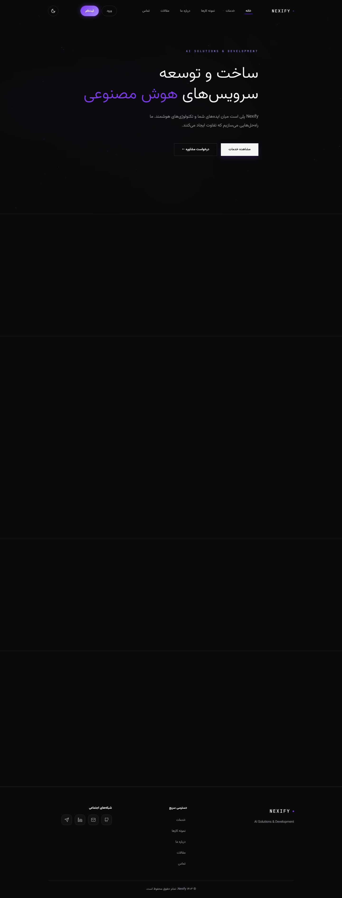
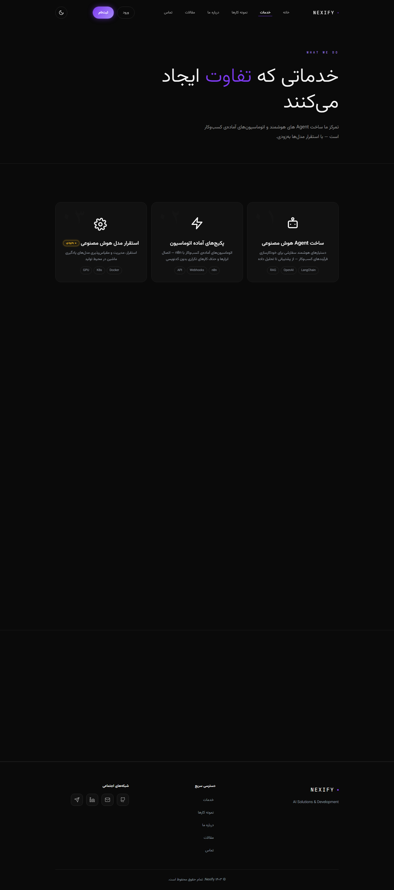
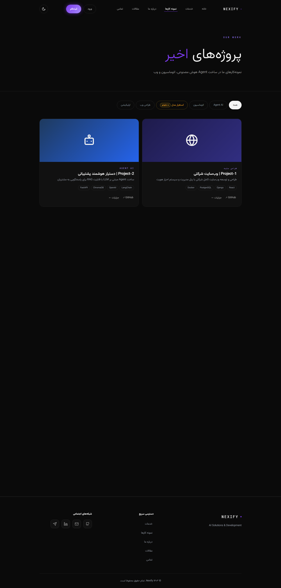
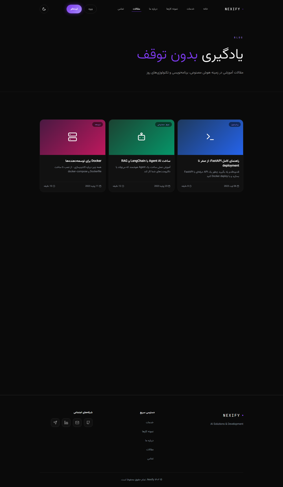
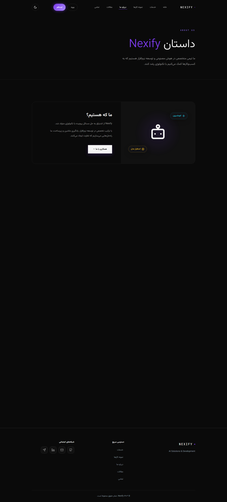
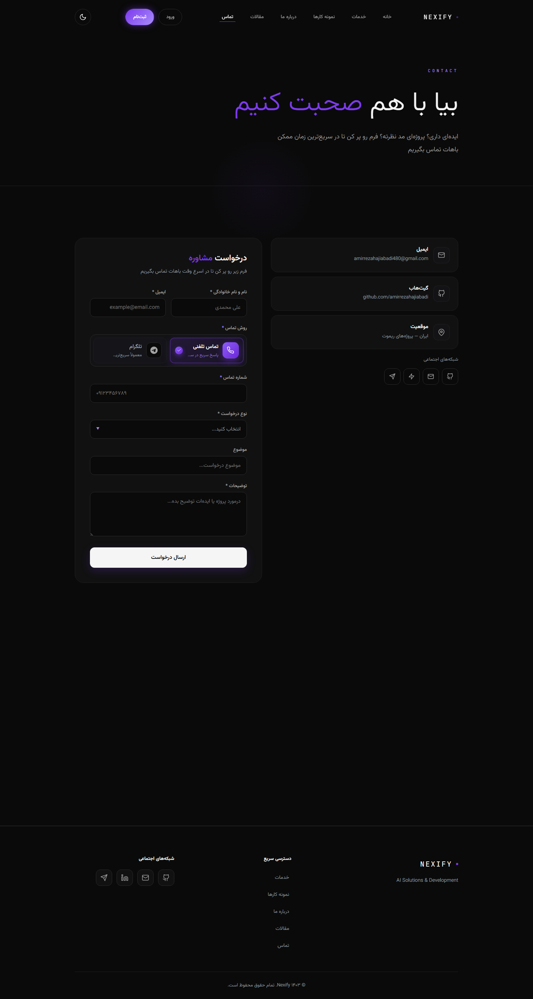
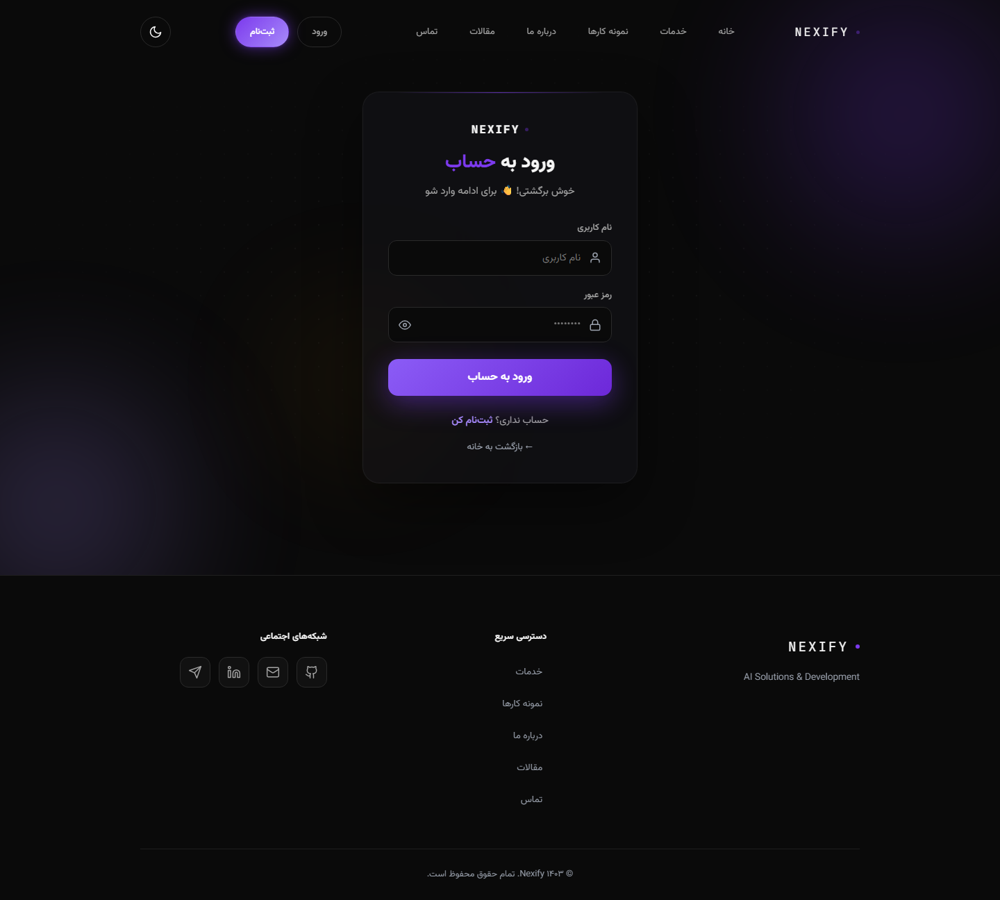
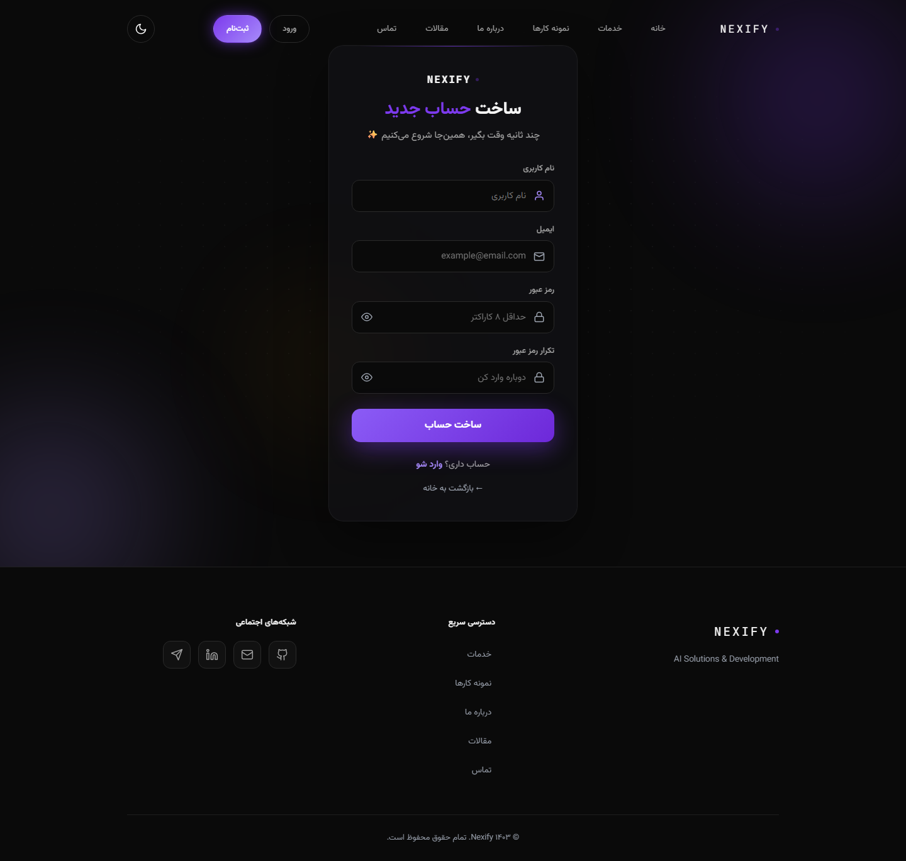

# ⚡ Nexify — وب‌سایت معرفی و توسعهٔ راه‌کارهای هوش مصنوعی

وب‌سایت کامل **فارسی و راست‌چین (RTL)** با تم تیره/روشن، طراحی شیشه‌ای (Glassmorphism)، انیمیشن‌های نرم و بک‌اند **Django** — ساخته‌شده به‌عنوان **نمونه‌کار** برای نمایش مهارت‌های طراحی UI/UX، فرانت‌اند و بک‌اند.

> 🎯 این مخزن یک **نمونه‌کار** است؛ هدف اصلی نمایش توانمندی‌هاست، نه توسعهٔ متن‌باز.

---

## 📸 پیش‌نمایش صفحات

| | |
|---|---|
|  |  |
|  |  |
|  |  |
|  |  |

> اسکرین‌شات‌ها با تم تیره (پیش‌فرض سایت) در عرض دسکتاپ ۱۴۴۰px گرفته شده‌اند.
> برای بازتولید بعد از تغییرات: `python scripts/capture_screenshots.py` (سرور در حال اجرا باشد).

---

## ✨ امکانات

- **طراحی UI/UX**: تم تیره/روشن با سیستم توکن رنگی، شیشه‌ای، RTL، انیمیشن‌های نرم و پلکانی، ریسپانسیو کامل (دسکتاپ تا موبایل)، آیکون‌های SVG سفارشی، کنتراست AA
- **بک‌اند Django**: settings سه‌گانه (`base`/`development`/`production`)، اپ‌های ماژولار (`core`, `projects`, `blog`, `contact`, `accounts`, `panel`)
- **پنل مدیریت سفارشی** (`/panel/`): انتشار مقاله و پروژه، آپلود تصویر شاخص، مدیریت سفارش‌ها و پیام‌ها، ویرایش متن‌های سایت، پشتیبانی از چند ادمین، آمار بازدید
- **حساب کاربری**: ورود/ثبت‌نام با انیمیشن، صفحهٔ پروفایل شخصی (درخواست‌های من + دیدگاه‌های من)، کامنت زیر مقالات
- **فرم تماس امن**: CSRF + هانی‌پات دولایه، اعتبارسنجی سمت سرور، انتخاب روش تماس (تماس تلفنی / تلگرام)
- **محتوای داینامیک**: پروژه‌ها و مقالات از دیتابیس با فیلتر انتشار
- **امنیت**: CSP، هدرهای امنیتی، ضد-XSS، بلاک ریدایرکت خارجی، **۱۱۵ تست pytest** + CI

---

## 🛠 تکنولوژی‌ها

| لایه | تکنولوژی |
|---|---|
| فرانت‌اند | HTML، CSS مدرن (Custom Properties، Flex/Grid، Glassmorphism)، JavaScript خالص |
| بک‌اند | Python، Django، SQLite (توسعه) / PostgreSQL (تولید) |
| تست | pytest + pytest-django، CI با GitHub Actions (Python 3.12/3.13) |
| فونت | Vazirmatn (self-host) + JetBrains Mono |

---

## 🚀 اجرای محلی

```bash
cd Nexify

python -m pip install -r requirements.txt
python manage.py migrate
python manage.py seed_demo            # دادهٔ نمونه (پروژه/مقاله/سوال متداول)
python manage.py createsuperuser      # برای ورود به /admin/ و /panel/
python manage.py runserver 127.0.0.1:8471
```

| مسیر | صفحه |
|---|---|
| `/` | خانه |
| `/services/` | خدمات |
| `/projects/` | نمونه‌کارها (دیتابیس) |
| `/blog/` | مقالات |
| `/about/` | درباره ما |
| `/contact/` | تماس (فرم امن) |
| `/accounts/` | ورود / ثبت‌نام / پروفایل |
| `/panel/` | پنل ادمین سفارشی (فقط staff) |

---

## 🔒 نکات امنیتی پیاده‌شده

- CSRF روی همهٔ فرم‌ها + **هانی‌پات دولایه** (کلاینت و سرور — پیام ربات ساکت رد می‌شود و ذخیره نمی‌شود)
- **CSP** در `base.html` + هدرهای امنیتی برای دیپلوی (`_headers` / `nginx-security.conf`)
- ساخت DOM امن بدون `innerHTML` با دادهٔ داینامیک (ضد XSS)
- ۱۱۵ تست pytest (فرم‌ها، ویوها، مدل‌ها، پنل، احراز هویت، امنیت) + CI خودکار

---

## 📬 تماس

این پروژه یک **نمونه‌کار** است — برای سفارش پروژهٔ مشابه یا همکاری، از طریق
[ایمیل](mailto:amirrezahajiabadi480@gmail.com) در تماس باشید.

---

## 📜 لایسنس

© ۱۴۰۵ Nexify — **تمام حقوق محفوظ است.**

این مخزن صرفاً برای نمایش نمونه‌کار منتشر شده است؛ استفاده، کپی یا بازنشر کد، طراحی یا محتوا بدون اجازهٔ کتبی مجاز نیست.
